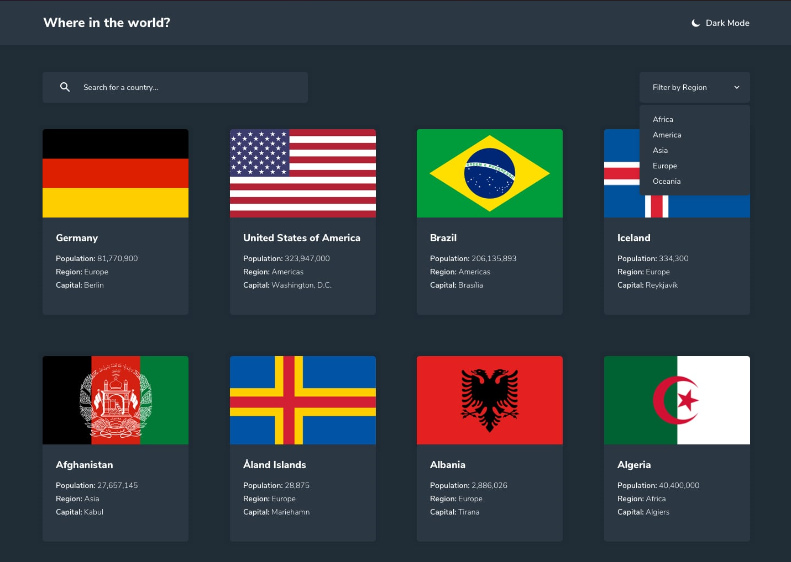
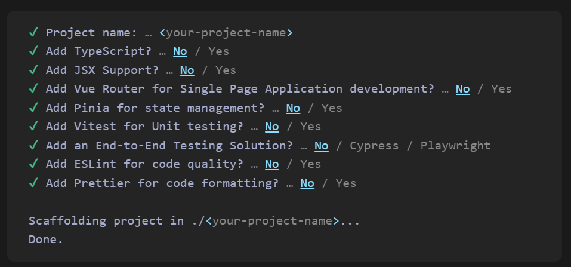
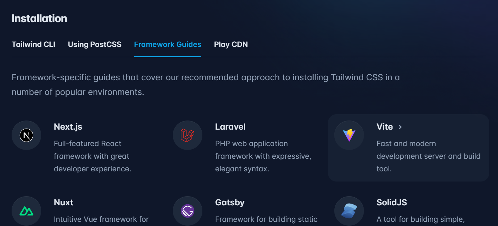
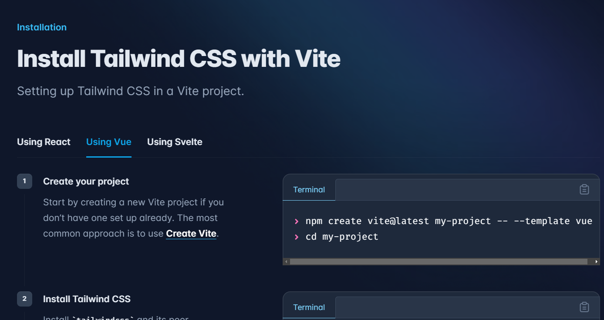
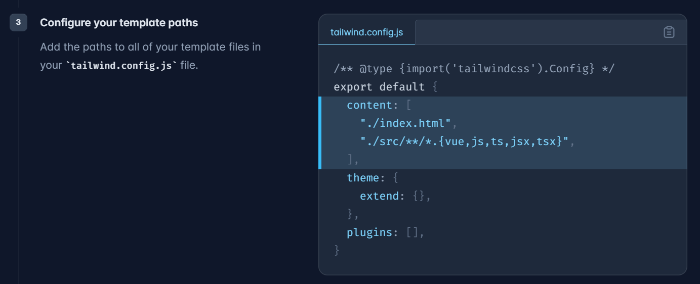
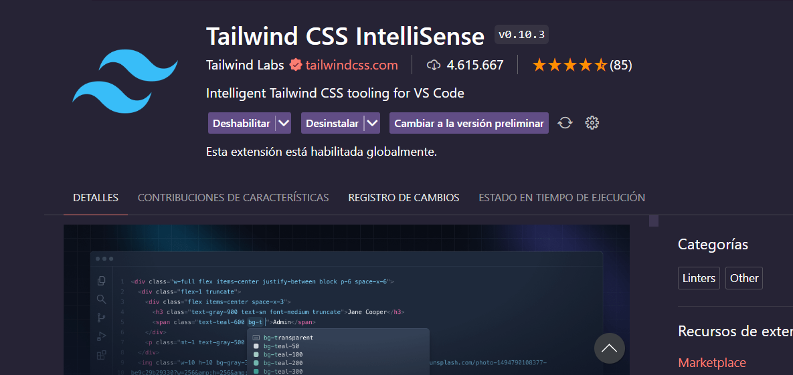

# Inicio del proyecto Vue Countries

El siguiente proyecto es una aplicación web que muestra información de los países del mundo, utilizando la API de [REST Countries](https://restcountries.com) la cual nos permite obtener información de los países del mundo, como su nombre, capital, población, bandera, entre otros.



## Requisitos

Para poder ejecutar el proyecto, necesitamos tener instalado [Node.js](https://nodejs.org/en/) en nuestro equipo, ya que es necesario para poder instalar las dependencias del proyecto y ejecutar el servidor de desarrollo.

## Creación del proyecto

Para crear el proyecto, vamos a utilizar el siguiente comando:

```bash
npm create vue@latest vue-countries
```



Una vez que se termine de crear el proyecto, nos ubicamos dentro de la carpeta del proyecto y ejecutamos el siguiente comando para instalar las dependencias:

```bash
cd vue-countries
npm install
```

Además, vamos a abrir el proyecto en nuestro editor de código favorito, en mi caso voy a utilizar [Visual Studio Code](https://code.visualstudio.com/).

```bash
code .
```

Luego correremos el servidor de desarrollo con el siguiente comando:

```bash
npm run dev
```

## Limpiando el proyecto

Una vez que se termine de crear el proyecto, vamos a eliminar los archivos que no vamos a utilizar, como por ejemplo el archivo `src/components/HelloWorld.vue`, archivo `base.css` y dejaremos vacío el archivo `src/App.vue`.

```vue
<script setup>
</script>

<template>
  
</template>

<style scoped>

</style>
```

Tambien debemos eliminar el contenido del archivo `src/assets/main.css`.

Si corremos el proyecto con el comando `npm run dev`, vamos a ver que la aplicación se muestra en blanco.


## Configurando el proyecto

Para este proyecto, vamos a utilizar [Tailwind CSS](https://tailwindcss.com) como framework CSS. Podes ver los pasos haciendo clic en `GET STARTED` en la página > Frameworks guides > Vite > Vue.



Tenemos que elegir que usaremos Vite con Vue



Vamos a obviar el paso 1, ya que ya tenemos creado el proyecto. En el paso 2, vamos a instalar las dependencias de Tailwind CSS.

```bash
npm install -D tailwindcss postcss autoprefixer
npx tailwindcss init -p
```
Veremos que se creó el archivo `tailwind.config.js` y el archivo `postcss.config.js`. Además, se a añadieron las dependencias en el package.json.

El paso 3, vamos a reemplazar el contenido del archivo `tailwind.config.js` por el siguiente:

```js
/** @type {import('tailwindcss').Config} */
export default {
  content: [
    "./index.html",
    "./src/**/*.{vue,js,ts,jsx,tsx}",
  ],
  theme: {
    extend: {},
  },
  plugins: [],
}
```



En el paso 4, vamos a agregar en el archivo `src/assets/main.css` el siguiente contenido:

```css
@tailwind base;
@tailwind components;
@tailwind utilities;
```

Estas son las configuraciones básicas para poder utilizar Tailwind CSS en nuestro proyecto.

Para poder ver reflejado el uso de Tailwind será necesario reiniciar el servidor de desarrollo.

#### Recomendación

Se recomienda el uso de [Tailwind CSS IntelliSense](https://marketplace.visualstudio.com/items?itemName=bradlc.vscode-tailwindcss) para poder tener autocompletado de las clases de Tailwind CSS.



