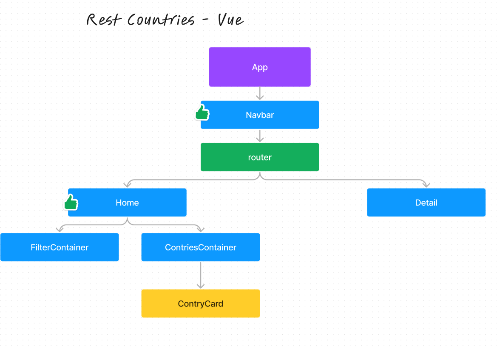

# Componentes de Vue

## Introducción

Los componentes son una parte fundamental de Vue. Un componente esencialmente es una instancia de Vue con opciones predefinidas. Los componentes son reutilizables y pueden ser utilizados en cualquier parte de la aplicación.

## Creando un componente

Para crear un componente con la sintaxis actual de Vue, solo basta con crear un archivo con extensión `.vue` y definir el componente dentro de este archivo. Por ejemplo, si queremos crear un componente llamado `MyComponent`, podemos crear un archivo llamado `MyComponent.vue` y definir el componente de la siguiente manera:

```vue
<script setup>

</script>

<template>

</template>

<style scoped>

</style>
```

En el bloque `<script setup>` se define la lógica del componente, en el bloque `<template>` se define la estructura del componente y en el bloque `<style scoped>` se define el estilo del componente.


## Usando un componente

Para usar un componente, solo basta con importarlo en el archivo donde se quiere usar y luego declararlo en la sección `components` de la instancia de Vue. Por ejemplo, si queremos usar el componente `MyComponent` en el archivo `App.vue`, podemos importarlo de la siguiente manera:

```vue
<script setup>
import MyComponent from './MyComponent.vue'
</script>

<template>

    <MyComponent />

</template>

<style scoped>

</style>
```

como se puede ver, primero importamos el componente dentro del bloque `<script setup>` y luego lo declaramos en la sección `components` de la instancia de Vue. Luego, podemos usar el componente dentro del bloque `<template>`.

**Nota** Es necesario que la ruta del componente sea relativa al archivo donde se quiere usar.


## Vue Countries Components

Vamos a crear los componentes necesarios para nuestro proyecto. Para esto, vamos a crear una carpeta llamada `components` dentro de la carpeta `src` y dentro de esta carpeta vamos a crear los siguientes archivos:

- `CountryCard.vue`
- `CountriesContainer.vue`
- `FilterContainer.vue`
- `Navbar.vue`

Además, crearemos una carpeta para los componentes de la página `Home` y `CountryDetails` a la cual llamaremos `pages` y dentro de esta carpeta crearemos los siguientes archivos:

- `Home.vue`
- `CountryDetails.vue`


## Components Schema




## Creando el componente Navbar

Vamos a crear el componente `Navbar.vue` dentro de la carpeta `components` y vamos a definir el componente de la siguiente manera:

```vue
<script setup>

</script>

<template>
    <header class="bg-darkBlue px-4 py-6 text-white">
        <div class="flex justify-between items-center">
            <h1 class="font-semibold">Where in the world?</h1>

            <button class="flex items-center gap-2">
                
                Dark mode
            </button>
        </div>
    </header>
</template>

<style scoped>

</style>
```

Como se puede ver, el componente `Navbar` tiene una estructura muy simple, solo tiene un encabezado con un título y un botón para cambiar el tema de la aplicación.


## Creando el componente Home

Vamos a crear el componente `Home.vue` dentro de la carpeta `pages` y vamos a definir el componente de la siguiente manera:

```vue
<script setup>
  import FilterContainer from '../components/FilterContainer.vue';
  import CountriesContainer from '../components/CountriesContainer.vue';
</script>

<template>
    <main class="px-4 py-6">
        <FilterContainer />
        <CountriesContainer />
    </main>
</template>

<style scoped>

</style>
```

Este componente es el componente principal de la página `Home`, en este componente vamos a importar los componentes `FilterContainer` y `CountriesContainer` y luego los vamos a usar dentro del bloque `<template>`.


## Creando el componente FilterContainer

Vamos a crear el componente `FilterContainer.vue` dentro de la carpeta `components` y vamos a definir el componente de la siguiente manera:

```vue
<script setup>
</script>

<template>

    <div class="flex justify-between flex-wrap gap-10">

        <!-- input search -->
        <div class="bg-darkBlue px-6 py-3 rounded-md flex items-center gap-2">
            <button>
                
            </button>
            <input class="text-white" type="text" placeholder="Search for a country...">
        </div>

        <!-- filter by region -->
        <select class="bg-darkBlue px-6 py-3 rounded-md text-white">
            <option selected disabled value="">Filter by Region</option>
            <option value="">Africa</option>
            <option value="">America</option>
            <option value="">Asia</option>
            <option value="">Europe</option>
            <option value="">Oceania</option>
        </select>

    </div>

</template>

<style scoped>

</style>
```

Este es nuestro componente `FilterContainer`, en este componente vamos a tener un input para buscar países y un select para filtrar por región.

Acá podemos observar una problemática, y es que se encuentra de forma muy repetitiva las opciones del select. Para solucionar esto vamos a usar una directiva de Vue llamada `v-for` que nos permite iterar sobre un arreglo y renderizar un elemento por cada elemento del arreglo. Para usar esta directiva, vamos a definir un arreglo llamado `regions` dentro del bloque `<script setup>` y vamos a iterar sobre este arreglo dentro del bloque `<template>`.


### v-for directive

v-for es una directiva de vue recorre un arreglo y renderiza un elemento por cada elemento del arreglo. Para usar esta directiva, solo basta con definir un arreglo dentro del bloque `<script setup>` y luego iterar sobre este arreglo dentro del bloque `<template>`.

Sintaxis:

```vue
<script setup>
    const items = ['item 1', 'item 2', 'item 3']
</script>

<template>
    <div v-for="item in items" :key="item.id">
        {{ item }}
    </div>
</template>
```

Como se puede ver, primero definimos un arreglo llamado `items` dentro del bloque `<script setup>` y luego iteramos sobre este arreglo dentro del bloque `<template>` con la directiva `v-for`. Además, es necesario definir un atributo `key` para cada elemento que se itera, este atributo es necesario para que Vue pueda identificar cada elemento de forma única.


### Aplicando v-for en FilterContainer

Vamos a aplicar la directiva `v-for` en el componente `FilterContainer` para evitar repetir las opciones del select. Para esto, vamos a definir un arreglo llamado `regions` dentro del bloque `<script setup>` y vamos a iterar sobre este arreglo dentro del bloque `<template>`.

```vue
<script setup>
    const regions = [
        'Africa',
        'America',
        'Asia',
        'Europe',
        'Oceania',
    ];
</script>

<template>

    <div class="flex justify-between flex-wrap gap-10">

        <!-- input search -->
        <div class="bg-darkBlue px-6 py-3 rounded-md flex items-center gap-2">
            <button>
                
            </button>
            <input class="text-white" type="text" placeholder="Search for a country...">
        </div>

        <!-- filter by region -->
        <select class="bg-darkBlue px-6 py-3 rounded-md text-white">
            <option selected disabled value="">Filter by Region</option>
            <option v-for="region in regions" :key="region" :value="region">{{ region }}</option>
        </select> 

    </div>

</template>

<style scoped>

</style>
```

Como se puede ver, primero definimos un arreglo llamado `regions` dentro del bloque `<script setup>` y luego iteramos sobre este arreglo dentro del bloque `<template>` con la directiva `v-for`. Además, es necesario definir un atributo `key` para cada elemento que se itera, este atributo es necesario para que Vue pueda identificar cada elemento de forma única.


## Tipos de componentes según su funcionalidad

Existen diferentes tipos de componentes según su funcionalidad, los cuales son:

- **Componentes inteligentes:** Son componentes que tienen lógica y estado, estos componentes son los que se encargan de hacer las peticiones a la API y de manejar el estado de la aplicación.

- **Componentes presentacionales:** Son componentes que no tienen lógica ni estado, estos componentes solo se encargan de renderizar la información que reciben como propiedades.
