# Componentes inteligentes y componentes presentacionales

## Componentes inteligentes

Los componentes inteligentes son componentes que tienen lógica y estado, estos componentes son los que se encargan de hacer las peticiones a la API y de manejar el estado de la aplicación. En nuestro caso tenemos un componente llamado `CountriesContainer.vue` que es el componente inteligente de nuestra aplicación.

### CountriesContainer.vue

Este componente será el encargado de hacer las peticiones a la API y de manejar el estado de la aplicación. Para ello usaremos fetch para hacer las peticiones a la API.

```vue
<script setup>

</script>

<template>

</template>

<style scoped>

</style>
```

### Ciclo de vida de un componente

Todos los componentes tienen un ciclo de vida, el cual se compone de diferentes hooks (funciones) que se ejecutan en diferentes momentos del ciclo de vida del componente. En nuestro caso vamos a usar el hook `onMounted` para hacer la petición a la API cuando el componente se monte en el DOM.

```vue
<script setup>
    import { onMounted } from 'vue'; // importamos el hook onMounted

    onMounted(() => {
        console.log('El componente se ha montado en el DOM');
    });
</script>

<template>

</template>

<style scoped>

</style>
```

Como se puede apreciar en la consola del navegador el mensaje se muestra cuando el componente se monta en el DOM.

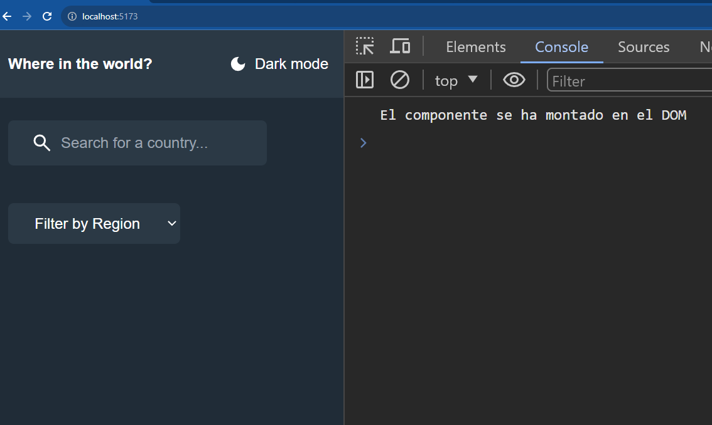

### Haciendo la petición a la API

Para hacer la petición a la API vamos a usar fetch, para ello vamos a crear una función llamada `fetchCountries` dentro del bloque `<script setup>` y vamos a llamar esta función dentro del hook `onMounted` para que se ejecute cuando el componente se monte en el DOM.

```vue
<script setup>
    import { onMounted } from 'vue'; // importamos el hook onMounted

    onMounted(() => { // llamamos la función fetchCountries cuando el componente se monte en el DOM
        fetchCountries();
    });

    const fetchCountries = async () => { // función para hacer la petición a la API
        const response = await fetch('https://restcountries.com/v3.1/all');
        const data = await response.json();
        console.log(data);
    }
</script>

<template>

</template>

<style scoped>

</style>
```

Lo que hemos logrado es comunicarnos con la API de países y obtener los datos de todos los países del mundo, aunque por el momento solo los estamos mostrando en la consola del navegador.

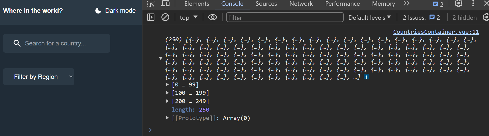

Sin embargo, hay algo que nos ha quedado abstracto, y es la función `fetchCountries` que hemos creado, ya que no sabemos que hace esta función. Para abordar este tema, vamos a ver todo lo que hace esta función y explicaremos cómo JavaScript nos permite realizar tareas asíncronas.

### Asincronismo en JavaScript

JavaScript es un lenguaje de programación asíncrono, lo que quiere decir que puede ejecutar varias tareas al mismo tiempo. Para entender esto mejor, vamos a ver un ejemplo.

```js
setTimeout(() => {
    console.log('Hola');
}, 4000);

    console.log('Mundo');
```

En este ejemplo tenemos dos tareas, la primera es la función `setTimeout` que se encarga de mostrar un mensaje en la consola después de 4 segundos, y la segunda es la función `console.log` que se encarga de mostrar un mensaje en la consola de forma instantánea. Si ejecutamos este código, veremos que primero se muestra el mensaje de la función `console.log` y después de 4 segundos se muestra el mensaje de la función `setTimeout`.

Podés acceder a la doc de [setTimeout](https://developer.mozilla.org/es/docs/Web/API/setTimeout) en la MDN.

Habiendo visto esto, hablaremos sobre una de las formas más usadas que tiene JavaScript para realizar tareas asíncronas, y es mediante el uso de **promesas**.

### Promesas

Las promesas son objetos que representan la terminación o el fracaso eventual de una operación asíncrona. Las promesas son una forma de manejar las tareas asíncronas en JavaScript, y nos permiten encadenar tareas de forma asíncrona.

Podemos decir que las promesas son un valor a futuro, ya que no sabemos cuándo se va a cumplir la promesa, pero sabemos que en algún momento se va a cumplir.

Las promesas tienen tres estados:

- **Pendiente:** es el estado inicial, es decir, cuando se crea la promesa.
- **Cumplida:** es cuando la promesa se cumple.
- **Rechazada:** es cuando la promesa no se cumple.

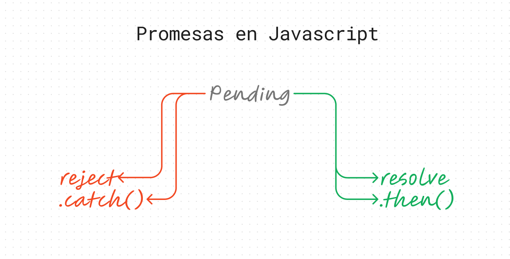

- **then:** es un método que se ejecuta cuando la promesa se cumple.
- **catch:** es un método que se ejecuta cuando la promesa no se cumple.

Vamos a trabajar con promesas para poder realizar una solicitud a la API de países y obtener los datos de todos los países del mundo.

```js
const response = fetch('https://restcountries.com/v3.1/all')
console.log(response);
```

Si ejecutamos este código, veremos que en la consola del navegador se muestra un objeto de tipo Promise, esto quiere decir que la función `fetch` nos devuelve una promesa.

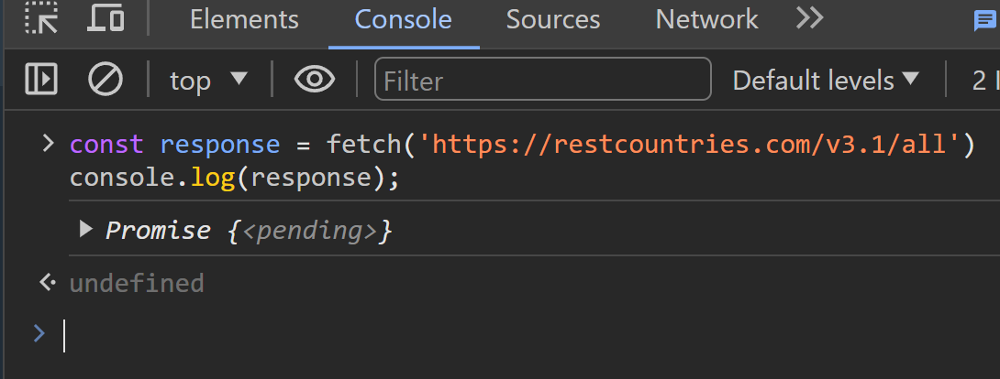

Sin embargo, este objeto de tipo Promise no nos sirve de mucho, ya que no podemos acceder a los datos de la API porque el estado de la promesa es pendiente. Para poder acceder a los datos de la API, debemos esperar a que la promesa se resuelva a través del método `then`.

```js
fetch('https://restcountries.com/v3.1/all').then( (resp)=>{
    console.log(resp);
});
```

Lo que hemos hecho es encadenar el método `then` a la promesa, y dentro de este método hemos creado una función que recibe como parámetro la respuesta de la promesa, y dentro de esta función mostramos la respuesta en la consola del navegador.

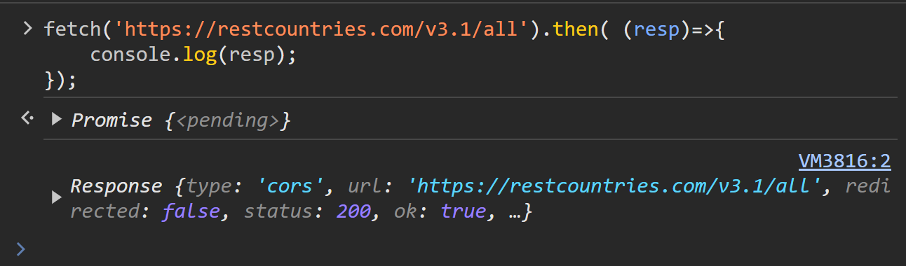

Ahora esta información ya es útil pero aún tenemos que procesarla para poder mostrarla en nuestra aplicación. Para ello vamos a convertir la respuesta de la promesa en un objeto JSON, para ello usaremos el método `json` que también nos devuelve una promesa.

```js
fetch('https://restcountries.com/v3.1/all')
    .then( resp => resp.json() )
    .then( data => console.log(data));
```

Lo que hemos hecho es encadenar otro método `then` a la promesa, el primer método `then` se encarga de convertir la respuesta de la promesa en un objeto JSON, y el segundo método `then` se encarga de mostrar los datos en la consola del navegador, esto ya que el método `json` también nos devuelve una promesa.

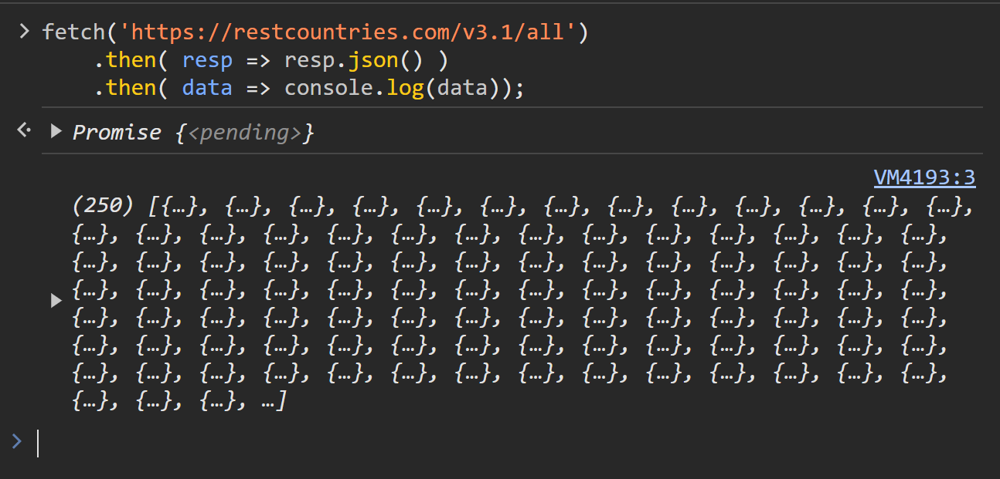

Ahora que ya tenemos los datos de la API en un objeto JSON, podemos acceder a los datos de los países del mundo.

#### Manejando errores con catch

Como hemos visto, las promesas tienen tres estados, y uno de ellos es el estado rechazado (`reject`), es decir, cuando la promesa no se cumple. Para manejar este estado, podemos encadenar el método `catch` a la promesa, y dentro de este método podemos crear una función que recibe como parámetro el error de la promesa, y dentro de esta función podemos mostrar el error en la consola del navegador.

```js
fetch('https://restcountries.com/v3.1/all')
    .then( resp => resp.json() )
    .then( data => console.log(data))
    .catch( error => console.log(error));
```

Evidentemente no nos va a mostrar ningún error, ya que la promesa se cumple, pero si cambiamos la URL de la API por una URL que no existe, veremos que nos muestra un error en la consola del navegador.

```js
fetch('https://restcountries.co/v3.1/all')
    .then( resp => resp.json() )
    .then( data => console.log(data))
    .catch( error => console.log(error));
```

Como se puede observar, el error que nos muestra es que la URL no existe, ya que a propósito hemos cambiado la URL de la API retirando la letra `m` de la URL.

### Async / Await una forma más simple de trabajar con promesas

Hemos visto que las promesas nos permiten realizar tareas asíncronas, pero hay una forma más simple de trabajar con promesas, y es mediante el uso de `async` y `await`.

Para esto volveremos a ver la función `fetchCountries` que habíamos creado anteriormente, y explicaremos cómo podemos usar `async` y `await` para hacer la petición a la API.

```js
const fetchCountries = async () => { // función para hacer la petición a la API
        const response = await fetch('https://restcountries.com/v3.1/all');
        const data = await response.json();
        console.log(data);
    }
```

Esta función es de tipo Async, lo que quiere decir que es una función asíncrona, y dentro de esta función tenemos dos variables, la primera es `response` que es la respuesta de la promesa, y la segunda es `data` que es la respuesta de la promesa convertida en un objeto JSON.

En lugar de aplicar el método `then` a la promesa, podemos usar la palabra reservada `await` para esperar a que la promesa se cumpla, y cuando la promesa se cumpla, podemos guardar la respuesta de la promesa en una variable. Para lograr que una función sea asíncrona, debemos usar la palabra reservada `async` antes de la palabra reservada `function` para funciones regulares y antes de los paréntesis de parámetros para funciones flecha.

#### Refactorizando el código para manejo de errores

Ahora que ya sabemos cómo usar `async` y `await` para hacer la petición a la API, vamos a refactorizar el código para manejar los errores de la petición a la API.

```js
const fetchCountries = async () => { // función para hacer la petición a la API
    try{
        const response = await fetch('https://restcountries.com/v3.1/all');
        const data = await response.json();
        console.log(data);
    }catch(error){
        console.log(error)
    }
}
```

Lo que hemos hecho es usar la palabra reservada `try` para intentar hacer la petición a la API, y si la petición a la API falla, usamos la palabra reservada `catch` para capturar el error y mostrarlo en la consola del navegador.

Por último, reescribiremos la función `fetchCountries` para que retorne los datos de la API.

```vue
<script setup>
    import { onMounted } from 'vue'; // importamos el hook onMounted

    onMounted(() => { // llamamos la función fetchCountries cuando el componente se monte en el DOM
        fetchCountries();
    });

    const fetchCountries = async () => { // función para hacer la petición a la API
    try{
        const response = await fetch('https://restcountries.com/v3.1/all');
        const data = await response.json();
        console.log(data);
    }catch(error){
        console.log(error)
    }
}
</script>

<template>

</template>

<style scoped>

</style>
```


### Guardando los datos de la API en el estado de la aplicación

Ahora que ya tenemos los datos de la API, vamos a guardarlos en el estado de la aplicación, para ello usaremos el hook `reactive` que nos permite crear un objeto reactivos, es decir, un objeto que cuando cambia sus propiedades, el componente se vuelve a renderizar.

```vue
<script setup>
    import { onMounted, reactive } from 'vue'; // importamos el hook onMounted

    const state = reactive({
        countries: [], // creamos un array vacío para almacenar los países
    }); // creamos un objeto reactivo

    onMounted(() => { // llamamos la función fetchCountries cuando el componente se monte en el DOM
        fetchCountries();
    });

    const fetchCountries = async () => { // función para hacer la petición a la API
    try{
        const response = await fetch('https://restcountries.com/v3.1/all');
        const data = await response.json();
        state.countries = data; // asignamos los datos al array de países
    }catch(error){
        console.log(error)
    }
}
</script>

<template>

</template>

<style scoped>

</style>
```

Como podemos observar, hemos creado un objeto reactivo llamado `state` que tiene una propiedad llamada `countries` que es un array vacío, y dentro de la función `fetchCountries` hemos guardado los datos de la API en la propiedad `countries` del objeto reactivo `state`.


#### Mostrando los datos de la API en la aplicación

Ahora que ya tenemos los datos de la API en el estado de la aplicación, vamos a mostrarlos en la aplicación, para ello usaremos por el momento una etiqueta `<ul>` y dentro de esta etiqueta vamos a iterar el array de países usando la directiva `v-for` y vamos a mostrar el nombre de cada país.

```vue
<script setup>
    import { onMounted, reactive } from 'vue'; // importamos el hook onMounted

    const state = reactive({
        countries: [], // creamos un array vacío para almacenar los países
    }); // creamos un objeto reactivo

    onMounted(() => { // llamamos la función fetchCountries cuando el componente se monte en el DOM
        fetchCountries();
    });

    const fetchCountries = async () => { // función para hacer la petición a la API
    try{
        const response = await fetch('https://restcountries.com/v3.1/all');
        const data = await response.json();
        state.countries = data; // asignamos los datos al array de países
    }catch(error){
        console.log(error)
    }
}
</script>

<template>
    <div class="text-white mt-12">
        <ul class="flex gap-8 flex-wrap justify-center">
           <article class="w-80 h-96 bg-darkBlue rounded shadow overflow-hidden" v-for="country in state.countries" :key="country.name.common">
               
            <div class="p-6">
                <h2 class="text-xl font-bold mb-4">{{country.name.common }}</h2>
                <p>Region: {{ country.region }}</p>
                <p>Population: {{ country.population }}</p>
            </div>
            </article>
        </ul>
    </div>
</template>

<style scoped>

</style>
```

Como podemos observar, hemos usado la directiva `v-for` para iterar el array de países y hemos usado la directiva `:key` para asignarle una clave única a cada país, y dentro de la etiqueta `<article>` hemos mostrado el nombre, la región y la población de cada país interpolando las propiedades del objeto `country`.

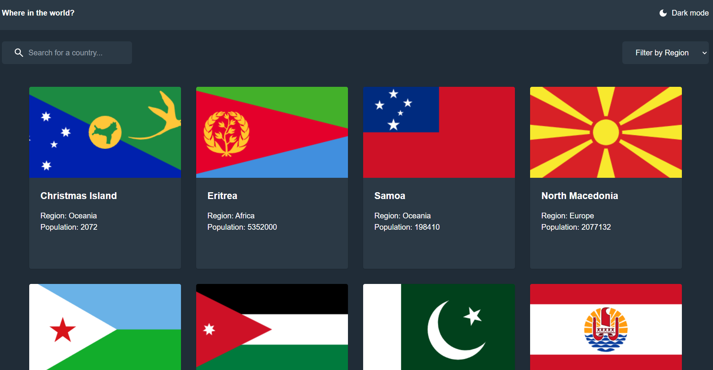

Lo que sucede es que en un momento dado el componente se monta y declara un estado inicial para el array de países, y después de un tiempo la petición a la API se cumple y el array de países cambia, pero el componente no se vuelve a renderizar, por lo que no se muestran los países en la aplicación.


## Componentes presentacionales

Los componentes presentacionales son componentes que no tienen lógica ni estado, estos componentes son los que se encargan de mostrar la información en la aplicación. En nuestro caso tenemos un componente llamado `CountryCard.vue` que es el componente presentacional de nuestra aplicación. Vamos a enviarle los datos de los países desde el componente inteligente al componente presentacional a través de las props.

### CountryCard.vue

Este componente será el encargado de mostrar la información de cada país en la aplicación. Para ello vamos a recibir los datos de los países a través de las props.

### Recibiendo los datos de los países a través de las props

Los componentes se comunican entre sí a través de las props, y para ello vamos a recibir los datos de los países a través de las props.


#### Declarando las props del componente

Para declarar las props del componente, debemos unar la función `defineProps` que nos permite declarar las props del componente.

```vue
<script setup>
// componente presentacional


// props
const props = defineProps({
  country: {
    type: Object,
    required: true,
  },
})

</script>

<template>
  <article
    class="w-80 h-96 bg-darkBlue rounded shadow overflow-hidden"
  >
    
    <div class="p-6">
      <h2 class="text-xl font-bold mb-4">{{ country.name.common }}</h2>
      <p>Region: {{ country.region }}</p>
      <p>Population: {{ country.population }}</p>
    </div>
  </article>
</template>

<style scoped></style>
```

Como podemos observar, hemos declarado una prop llamada `country` que es de tipo `Object` y es requerida, y dentro de la etiqueta `<template>` hemos interpolado las propiedades del objeto `country` para mostrar la información de cada país.


#### Enviando los datos de los países a través de las props

Ahora que ya hemos declarado las props del componente, vamos a enviar los datos de los países a través de las props.

```vue
<script setup>
// componente inteligente CountryContainer.vue
    import { onMounted, onUpdated, reactive } from 'vue'; // importamos el hook onMounted
    import CountryCard from './CountryCard.vue';
    const state = reactive({
        countries: [], // creamos un array vacío para almacenar los países
    }); // creamos un objeto reactivo

    onMounted(() => { // llamamos la función fetchCountries cuando el componente se monte en el DOM
        fetchCountries();
    });


    const fetchCountries = async () => { // función para hacer la petición a la API
    try{
        const response = await fetch('https://restcountries.com/v3.1/all');
        const data = await response.json();
        state.countries = data; // asignamos los datos al array de países
    }catch(error){
        console.log(error)
    }
}
</script>

<template>
    <div class="text-white mt-12">
        <ul class="flex gap-8 flex-wrap justify-center">
           <CountryCard v-for="country in state.countries" :key="country.name.common" :country="country"/>
        </ul>
    </div>
</template>

<style scoped>

</style>
```

Como podemos observar, hemos importado el componente `CountryCard.vue` y hemos usado la etiqueta `<CountryCard>` para enviar los datos de los países a través de la prop `country`.

Cabe señalar que hemos usado la directiva `v-for` para iterar el array de países y hemos usado la directiva `:key` para asignarle una clave única a cada país.

Las props se pasan desde el componente contenedor usando la sintaxis `:nombreProp="valorProp"`, y se reciben en el componente item usando la función `defineProps`.

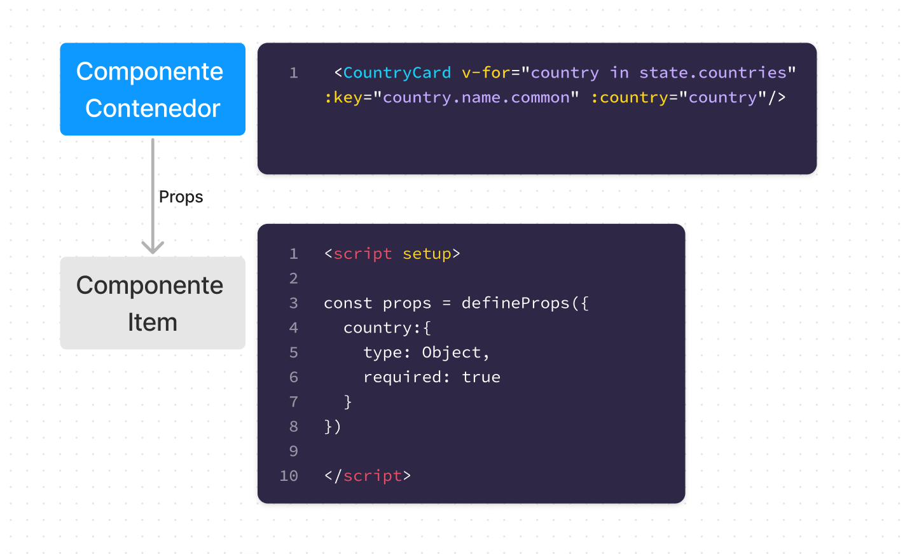


## Comunicación entre componentes hermanos

Los componentes hermanos son componentes que están en el mismo nivel jerárquico, es decir, que están en el mismo nivel de profundidad en el árbol de componentes. En nuestro caso tenemos dos componentes hermanos llamados `CountriesContainer.vue` y `FilterContainer.vue` que son los componentes hermanos que están montados en un componente más grande llamado `Home.vue`.

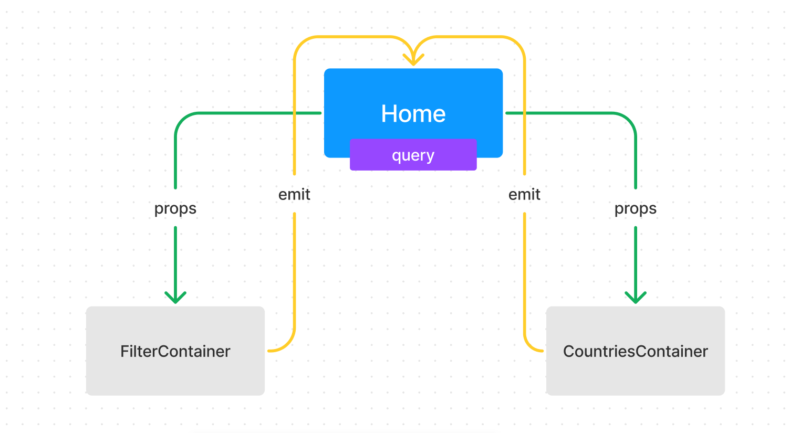


En primera instancia vamos a compartir un estado entre los componentes hermanos, a este estado le llamaremos `query` y será un string vacío que luego usaremos para filtrar los países por nombre.

### Declaramos el estado compartido

Para declarar el estado compartido usaremos la funcion `reactive` que nos permite crear un objeto reactivo, y dentro de este objeto reactivo crearemos una propiedad llamada `query` que será un string vacío.

```vue
<script setup>
  import FilterContainer from '../components/FilterContainer.vue';
  import CountriesContainer from '../components/CountriesContainer.vue';

  import { onMounted, reactive } from 'vue';

  const state = reactive({
    query: '',
  });

</script>

<template>
    <main class="px-4 py-6">
        <FilterContainer />
        <CountriesContainer :query="state.query"/>
    </main>
</template>

<style scoped>

</style>
```

Como podemos observar, hemos importado los componentes `FilterContainer.vue` y `CountriesContainer.vue` y hemos usado la etiqueta `<FilterContainer>` para montar el componente `FilterContainer.vue` y hemos usado la etiqueta `<CountriesContainer>` para montar el componente `CountriesContainer.vue` y hemos usado la directiva `:query` para enviar el estado compartido `query` al componente `CountriesContainer.vue` como una prop.

Además, declaramos un estado compartido llamado `state` que es un objeto reactivo que tiene una propiedad llamada `query` que es un string vacío.

### Enviamos el estado compartido a través de las props

En la llamada al componente CountriesContainer.vue, enviamos el estado compartido a través de las props.

```vue
<CountriesContainer :query="state.query"/>
```
y además, tenemos que declarar la prop en el componente CountriesContainer.vue

```vue
<script setup>
    // componente inteligente CountryContainer.vue
    import { onMounted, onUpdated, reactive } from 'vue'; // importamos el hook onMounted
    import CountryCard from './CountryCard.vue';
    const state = reactive({
        countries: [], // creamos un array vacío para almacenar los países
    }); // creamos un objeto reactivo

    onMounted(() => { // llamamos la función fetchCountries cuando el componente se monte en el DOM
        fetchCountries();
    });

    const props = defineProps({
        query: {
            type: String,
            required: false,
        },
    });

    onUpdated(() => {
        if(props.query){
            state.countries = state.dataCountries.filter(country => country.name.common.toLowerCase().includes(props.query.toLowerCase()));
        }
    });

    const fetchCountries = async () => { // función para hacer la petición a la API
    try{
        const response = await fetch('https://restcountries.com/v3.1/all');
        const data = await response.json();
        state.countries = data; // asignamos los datos al array de países
    }catch(error){
        console.log(error)
    }
}
</script>

<template>
    <div class="text-white mt-12">
        <ul class="flex gap-8 flex-wrap justify-center">
           <CountryCard v-for="country in state.countries" :key="country.name.common" :country="country"/>
        </ul>
    </div>
</template>

<style scoped>

</style>
```

### Seteamos el estado compartido desde el componente FilterContainer.vue a través de un emisor de eventos (emit)

Para setear el estado compartido desde el componente `FilterContainer.vue` vamos a usar un emisor de eventos (emit), para ello vamos a crear un método llamado `setQuery` que recibe como parámetro el valor del input y dentro de este método vamos a emitir un evento llamado `setQuery` y vamos a pasarle como argumento el valor del input.

```vue
<script setup>
const regions = ["Africa", "America", "Asia", "Europe", "Oceania"];

const query = "";
</script>

<template>
  <div class="flex justify-between flex-wrap gap-10">
    <!-- input search -->
    <div class="bg-darkBlue px-6 py-3 rounded-md flex items-center gap-2">
      <button @click="$emit('handleQuery', query)">
        
      </button>
      <input
        v-model="query"
        class="text-white"
        type="text"
        placeholder="Search for a country..."
      />
    </div>

    <!-- filter by region -->
    <select class="bg-darkBlue px-6 py-3 rounded-md text-white">
      <option selected disabled value="">Filter by Region</option>
      <option v-for="region in regions" :key="region" :value="region">
        {{ region }}
      </option>
    </select>
  </div>
</template>

<style scoped></style>

```

Como podemos observar, hemos usado la directiva `@click` para escuchar el evento `click` y hemos usado la directiva `v-model` para enlazar el valor del input con la propiedad `query` del componente.

Con esto ya podemos crear un $emit para enviar el valor del input al componente padre. La sintaxis de un $emit es la siguiente:

```vue
<script setup>
    <button @click="$emit('handleQuery', query)">
        
      </button>
</script>
```

```js
$emit('nombreDeEventoPersonalizado', valorQueQuieroEnviar)
```

### Recibir el valor emitiendo desde el componente padre

Ahora que ya hemos emitido el valor del input desde el componente `FilterContainer.vue`, vamos a recibir este valor emitiendo desde el componente padre, para ello vamos a usar la directiva `v-on` para escuchar el evento `handleQuery` y vamos a setear el estado compartido `query` con el valor del input.

```vue
<script setup>
  import FilterContainer from '../components/FilterContainer.vue';
  import CountriesContainer from '../components/CountriesContainer.vue';

  import { onMounted, reactive } from 'vue';

  const state = reactive({
    query: '',
  });

  
</script>

<template>
    <main class="px-4 py-6">
        <FilterContainer @handleQuery=" (query) => { state.query = query }" />
        <CountriesContainer :query="state.query"/>
    </main>
</template>

<style scoped>

</style>
```

Como podemos observar, hemos usado la directiva `v-on` o `@` para escuchar el evento `handleQuery` y hemos usado la sintaxis de una función flecha para recibir el valor del input y setear el estado compartido `query` con el valor del input.


### Detectar cambios en el estado compartido

Ahora que ya hemos enviado y recibido el valor del input, vamos a detectar los cambios en el estado compartido `query` para filtrar los países por nombre. Es decir que el componente `CountriesContainer.vue` debe estar escuchando los cambios en el estado compartido `query` para filtrar los países por nombre.

Para detectar los cambios en el estado compartido `query` vamos a usar el hook `onUpdated` que nos permite detectar los cambios en el estado de la aplicación, y dentro de este hook vamos a crear una condicional que se encargue de filtrar los países por nombre.

```vue
<script setup>
    import { onMounted, onUpdated, reactive } from 'vue'; // importamos el hook onMounted
    import CountryCard from './CountryCard.vue';
    const state = reactive({
        countries: [], // creamos un array vacío para almacenar los países filtrados
        dataCountries: [], // creamos un array vacío para almacenar los países sin filtrar que vengan de la API
    }); // creamos un objeto reactivo

    onMounted(() => { // llamamos la función fetchCountries cuando el componente se monte en el DOM
        fetchCountries();
    });

    onUpdated(()=>{
        if(props.query){
            state.countries = state.dataCountries.filter( country => country.name.common.toLowerCase().includes(props.query.toLowerCase()) )
        }
    })
    
    const props = defineProps({
        query: {
            type: String,
            required: false,
        },
    });
    
    const fetchCountries = async () => { // función para hacer la petición a la API
    try{
        const response = await fetch('https://restcountries.com/v3.1/all');
        const data = await response.json();
        state.countries = data; // asignamos los datos al array de países
        state.dataCountries = data; // asignamos los datos al array de países
    }catch(error){
        console.log(error)
    }
}
</script>

<template>
    <div class="text-white mt-12">
        <ul class="flex gap-8 flex-wrap justify-center">
           <CountryCard v-for="country in state.countries" :key="country.name.common" :country="country"/>
        </ul>
    </div>
</template>

<style scoped>

</style>

```

Como podemos observar, hemos usado el hook `onUpdated` para detectar los cambios en el estado compartido `query` y hemos usado una condicional para filtrar los países por nombre.

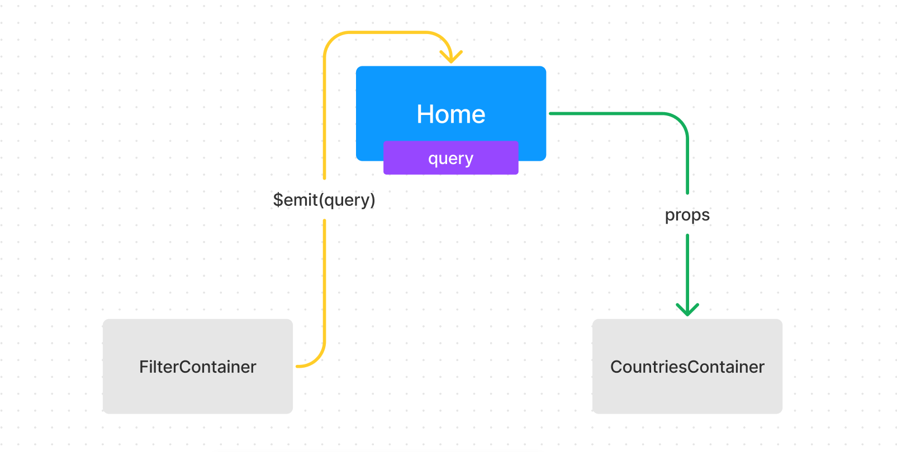


### Problema de rendimiento al filtrar los países


#### Problema 1: Ciclo infinito de renderizado
Ya estamos filtrando los países por nombre, pero tenemos un problema de rendimiento, ya que cada vez que emitimos el valor del input, la query se actualiza y el componente se vuelve a renderizar. Esto no sería un problema pero tenemos un hook onUpdated que se ejecuta cada vez que el state del componente cambia, sin embargo caemos en un ciclo infinito de renderizado.

Y es que según la documentación de Vue, el hook onUpdated se ejecuta cada vez que el componente se actualiza, y como estamos actualizando el state del componente cada vez que se actualiza el input, el componente se vuelve a renderizar y se ejecuta el hook onUpdated, y así sucesivamente.

Es decir que onUpdated no estaría recomendado para esta acción ya que tenemos que setear un estado tambien.

#### Solución 1: Usar un watcher

Un watcher es una función que se ejecuta cada vez que una propiedad del componente cambia, y para ello vamos a usar el hook `watch` que nos permite crear un watcher.

```vue
<script setup>
    import { onMounted, onUpdated, reactive, watch } from 'vue'; // importamos el hook onMounted
    import CountryCard from './CountryCard.vue';
    const state = reactive({
        countries: [], // creamos un array vacío para almacenar los países filtrados
        dataCountries: [], // creamos un array vacío para almacenar los países sin filtrar que vengan de la API
    }); // creamos un objeto reactivo
    
    const props = defineProps({
        query: {
            type: String,
            required: false,
        },
    });

    onMounted(() => { // llamamos la función fetchCountries cuando el componente se monte en el DOM
        fetchCountries();
    });

    watch( () => props.query, ()=>{
        if(props.query){
            state.countries = state.dataCountries.filter( country => country.name.common.toLowerCase().includes(props.query.toLowerCase()) )
        }else{
            state.countries = state.dataCountries
        }
    })
    
    
    const fetchCountries = async () => { // función para hacer la petición a la API
    try{
        const response = await fetch('https://restcountries.com/v3.1/all');
        const data = await response.json();
        state.countries = data; // asignamos los datos al array de países
        state.dataCountries = data; // asignamos los datos al array de países
    }catch(error){
        console.log(error)
    }
}
</script>

<template>
    <div class="text-white mt-12">
        <ul class="flex gap-8 flex-wrap justify-center">
           <CountryCard v-for="country in state.countries" :key="country.name.common" :country="country"/>
        </ul>
    </div>
</template>

<style scoped>

</style>
```

Ya que el valor que necesita observar el watcher debe ser de una fuente reactiva válida, entonces vamos a pasar una función que retorne `props.query` y como segundo argumento vamos a pasar una función que se va a ejecutar cada vez que `props.query` cambie.


#### Problema 2: Las búsquedas no son exactas ya que se filtran por coincidencias sin importar el orden de las letras

Ya estamos filtrando los países por nombre, pero tenemos otro problema de rendimiento, ya que las búsquedas no son exactas, ya que se filtran por coincidencias sin importar el orden de las letras. Por ejemplo, si buscamos `Argentina` nos muestra `Argentina`, `Argentina, República de`, `Argelia`, `Armenia`, `Azerbaiyán`, `Bulgaria`, `Burkina Faso`, `Georgia`, `Madagascar`, `Mongolia`, `Nigeria`, `Tanzania`, `Tayikistán`, `Turkmenistán`, `Uzbekistán`, `Zimbabue`, ya que todas estas coinciden con la palabra `Argentina`.

#### Solución 2: Filtrar los países por nombre exacto usando una RegExp

Para solucionar este problema vamos a filtrar los países por nombre exacto usando una RegExp, para ello vamos a crear una constante llamada `regex` que va a ser una RegExp que va a recibir como parámetro el valor del input y vamos a usar esta RegExp para filtrar los países por nombre exacto.

```vue
<script setup>
import { onMounted, onUpdated, reactive, watch } from "vue"; // importamos el hook onMounted
import CountryCard from "./CountryCard.vue";

const state = reactive({
  countries: [], // creamos un array vacío para almacenar los países filtrados
  dataCountries: [], // creamos un array vacío para almacenar los países sin filtrar que vengan de la API
}); // creamos un objeto reactivo

const props = defineProps({
  query: {
    type: String,
    required: false,
  },
});

onMounted(() => {
  // llamamos la función fetchCountries cuando el componente se monte en el DOM
  fetchCountries();
});

watch(
  () => props.query,
  () => {
    if (props.query) {
      const regex = new RegExp(`^${props.query.toLocaleLowerCase()}`, 'i'); // creamos una expresión regular para filtrar los países por nombre de acuerdo al orden de las letras
      state.countries = state.dataCountries.filter((country) =>
        regex.test(country.name.common.toLocaleLowerCase())
      );
    } else {
      state.countries = state.dataCountries;
    }
  }
);

const fetchCountries = async () => {
  // función para hacer la petición a la API
  try {
    const response = await fetch("https://restcountries.com/v3.1/all");
    const data = await response.json();
    state.countries = data; // asignamos los datos al array de países
    state.dataCountries = data; // asignamos los datos al array de países
  } catch (error) {
    console.log(error);
  }
};
</script>

<template>
  <div class="text-white mt-12">
    <ul class="flex gap-8 flex-wrap justify-center">
      <CountryCard
        v-for="country in state.countries"
        :key="country.name.common"
        :country="country"
      />
    </ul>
  </div>
</template>

<style scoped></style>
```

Como podemos observar, hemos creado una constante llamada `regex` que es una RegExp que recibe como parámetro el valor del input y hemos usado esta RegExp para filtrar los países por nombre exacto.

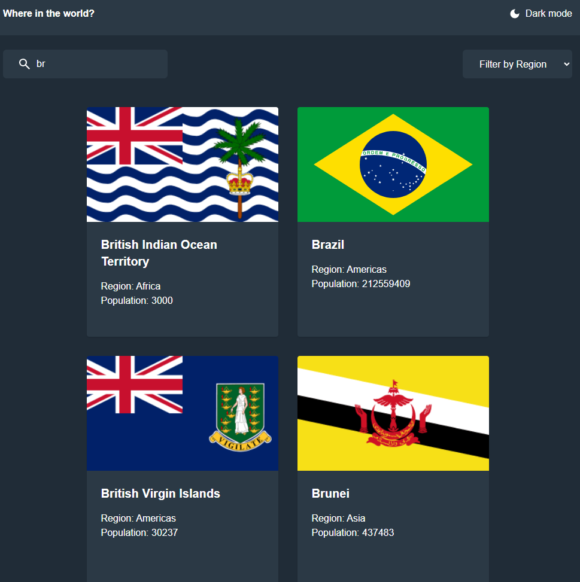